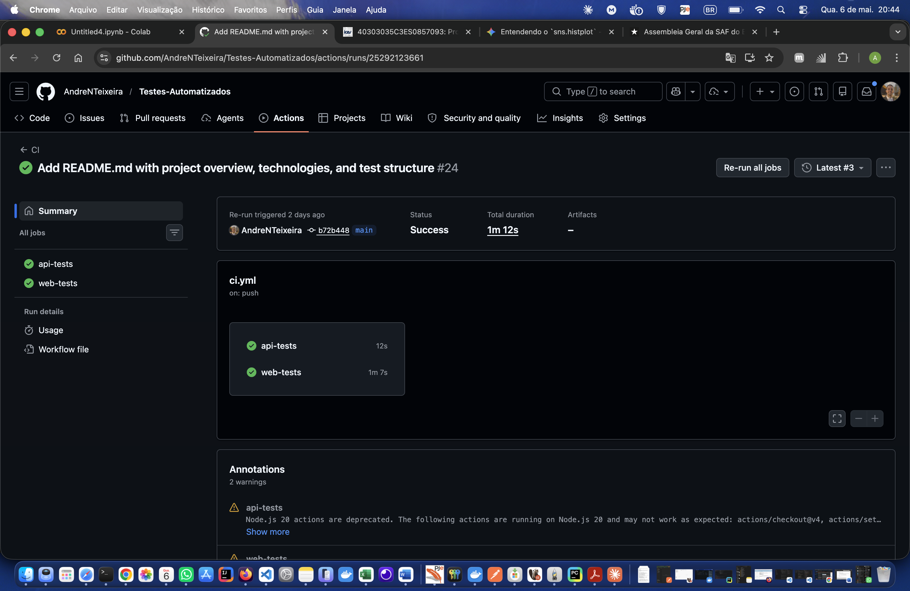
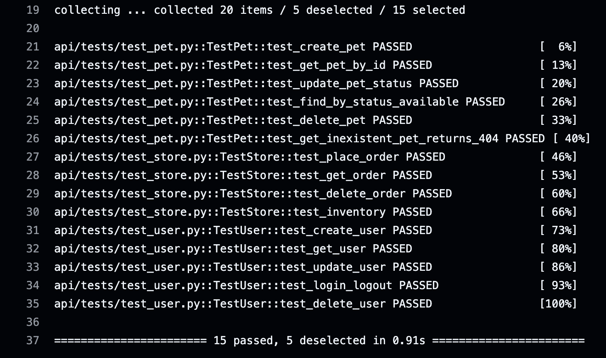
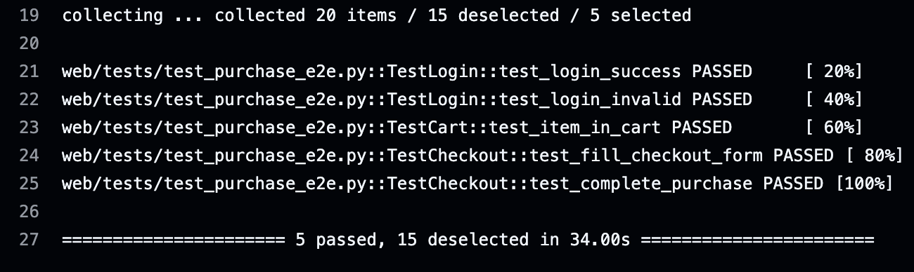

# Framework de Automação de Testes QA

Projeto de automação de testes desenvolvido em Python, cobrindo testes de API REST e testes End-to-End (E2E) de interface web. Utiliza pytest como runner, requests para testes de API e Selenium para testes web, com integração contínua via GitHub Actions.

---

## Aplicações Testadas

| Suite | Aplicação | Tipo |
|-------|-----------|------|
| API | [Petstore Swagger](https://petstore.swagger.io/v2) | API REST pública |
| Web | [SauceDemo](https://www.saucedemo.com) | E-commerce React (SPA) |

---

## Tecnologias

- **Python 3.12**
- **pytest 8.3.3** — runner de testes e gerenciamento de fixtures
- **requests 2.32.3** — cliente HTTP para testes de API
- **Selenium 4.25.0** — automação de navegador para testes E2E
- **jsonschema 4.23.0** — validação de esquemas JSON
- **GitHub Actions** — pipeline de CI/CD

---

## Estrutura do Projeto

```
.
├── api/                        # Suite de testes de API
│   ├── clients/                # Clientes HTTP por domínio
│   │   ├── base_client.py      # URL base e sessão compartilhada
│   │   ├── pet_client.py       # Endpoints de Pet
│   │   ├── store_client.py     # Endpoints de Store (pedidos)
│   │   └── user_client.py      # Endpoints de User
│   ├── data/
│   │   └── payloads.py         # Geradores de dados de teste
│   ├── tests/
│   │   ├── test_pet.py         # 6 testes de Pet
│   │   ├── test_store.py       # 4 testes de Store
│   │   └── test_user.py        # 5 testes de User
│   └── conftest.py             # Fixtures de sessão HTTP e clientes
│
├── web/                        # Suite de testes E2E web
│   ├── pages/                  # Page Objects (POM)
│   │   ├── base_page.py        # Classe base com esperas e ações comuns
│   │   ├── login_page.py       # Página de login
│   │   ├── inventory_page.py   # Página de produtos
│   │   ├── cart_page.py        # Carrinho de compras
│   │   ├── checkout_page.py    # Formulário de checkout (step 1)
│   │   └── checkout_complete_page.py  # Confirmação de compra (step 2+)
│   ├── tests/
│   │   └── test_purchase_e2e.py  # 5 testes E2E
│   └── conftest.py             # Fixtures do WebDriver e estados de página
│
├── .github/workflows/
│   └── ci.yml                  # Pipeline CI com jobs separados
├── pytest.ini                  # Configuração do pytest e markers
└── requirements.txt            # Dependências do projeto
```

---

## Como Executar Localmente

### Pré-requisitos

- Python 3.12+
- Google Chrome instalado
- ChromeDriver compatível com a versão do Chrome (ou `webdriver-manager`)

### Instalação

```bash
# Clone o repositório
git clone https://github.com/AndreNTeixeira/Testes-Automatizados
cd Testes-Automatizados

# Crie e ative o ambiente virtual
python -m venv .venv
source .venv/bin/activate        # Linux/macOS
.venv\Scripts\activate           # Windows

# Instale as dependências
pip install -r requirements.txt
```

### Executando os Testes

```bash
# Todos os testes
pytest

# Apenas testes de API
pytest -m api

# Apenas testes Web (E2E)
pytest -m web

# Gerar relatório HTML
pytest --html=report.html --self-contained-html
```

---

## Suite de Testes de API

### Arquitetura

Os testes de API seguem uma arquitetura em camadas:

```
conftest.py (fixtures)
    └── BaseClient (sessão HTTP + URL base)
            ├── PetClient
            ├── StoreClient
            └── UserClient
```

**`BaseClient`** mantém a URL base da API e uma `requests.Session` compartilhada entre todos os clientes. Cada cliente especializado herda do `BaseClient` e expõe métodos que correspondem diretamente aos endpoints da API.

**`payloads.py`** gera dados únicos por execução usando timestamp (`time.time() * 1000`), evitando conflitos entre execuções paralelas ou consecutivas.

### Fixtures (api/conftest.py)

| Fixture | Escopo | Responsabilidade |
|---------|--------|-----------------|
| `http` | sessão | Cria e encerra a `requests.Session` uma única vez por suite |
| `user_client` | função | Instancia `UserClient` com a sessão HTTP |
| `store_client` | função | Instancia `StoreClient` com a sessão HTTP |
| `pet_client` | função | Instancia `PetClient` com a sessão HTTP |

### Testes Cobertos

**TestPet** (`test_pet.py`) — 6 testes
- Criar pet (`POST /pet`)
- Buscar pet por ID (`GET /pet/{id}`)
- Atualizar status do pet (`PUT /pet`)
- Buscar pets por status (`GET /pet/findByStatus`)
- Deletar pet e confirmar remoção (`DELETE /pet/{id}` + `GET`)
- Pet inexistente retorna 404

**TestStore** (`test_store.py`) — 4 testes
- Criar pedido (`POST /store/order`)
- Buscar pedido por ID (`GET /store/order/{id}`)
- Deletar pedido (`DELETE /store/order/{id}`)
- Consultar inventário (`GET /store/inventory`)

**TestUser** (`test_user.py`) — 5 testes
- Criar usuário (`POST /user`)
- Buscar usuário por username (`GET /user/{username}`)
- Atualizar dados do usuário (`PUT /user/{username}`)
- Login e logout (`GET /user/login` + `/user/logout`)
- Deletar usuário (`DELETE /user/{username}`)

---

## Suite de Testes Web (E2E)

### Arquitetura — Page Object Model (POM)

O padrão POM separa a lógica de localização de elementos e ações de página dos testes em si. Cada página da aplicação é representada por uma classe Python.

```
BasePage
    ├── LoginPage
    ├── InventoryPage
    ├── CartPage
    ├── CheckoutPage
    └── CheckoutCompletePage
```

**`BasePage`** centraliza as esperas do Selenium e as ações comuns:
- `find(locator)` — aguarda o elemento estar presente no DOM
- `click(locator)` — aguarda presença e clica
- `type(locator, text)` — aguarda visibilidade, limpa o campo e digita
- `get_text(locator)` — retorna o texto do elemento
- `wait` — `WebDriverWait` com timeout de 20 segundos (para localizar elementos)
- `short_wait` — `WebDriverWait` com timeout de 5 segundos (para verificar navegação)

### Fixtures em Cadeia (web/conftest.py)

As fixtures formam uma cadeia de pré-condições, onde cada nível entrega o driver já no estado correto para o próximo:

```
driver
  └── logged_in        → faz login como standard_user
        └── cart_ready → adiciona o primeiro item e vai ao carrinho
              └── checkout_ready → clica em "Checkout"
```

Cada teste recebe o driver exatamente no estado que precisa, sem repetir código de setup.

### Padrão de Navegação com Fallback

O SauceDemo é uma Single Page Application (SPA) em React. Em ambientes de CI com Chrome headless, o React Router frequentemente intercepta os cliques nos botões mas não completa a navegação dentro do tempo esperado.

Para contornar isso, todas as ações de navegação seguem o mesmo padrão:

```python
# 1. Tenta clicar normalmente
ActionChains(self.driver).move_to_element(btn).click().perform()

# 2. Aguarda 5 segundos para a URL mudar
try:
    self.short_wait.until(EC.url_contains("destino"))

# 3. Se não navegou, vai direto pela URL
except TimeoutException:
    self.driver.get("https://www.saucedemo.com/destino.html")
    self.wait.until(EC.url_contains("destino"))
```

Esse padrão está presente em: `go_to_cart()`, `proceed_to_checkout()`, `continue_to_overview()` e `finish_purchase()`.

### Testes Cobertos

**TestLogin** — 2 testes
- Login com credenciais válidas redireciona para `/inventory`
- Login com credenciais inválidas exibe mensagem de erro

**TestCart** — 1 teste
- Primeiro item adicionado aparece corretamente no carrinho

**TestCheckout** — 2 testes
- Preenchimento do formulário de checkout navega para a revisão do pedido
- Fluxo completo de compra exibe mensagem de confirmação "Thank you for your order!"

---

## Integração Contínua (CI)

O pipeline no GitHub Actions executa automaticamente em cada `push` ou `pull request` para a branch `main`.

```yaml
# Dois jobs independentes e paralelos
api-tests   → pytest -m api    (sem dependências externas de sistema)
web-tests   → pytest -m web    (instala google-chrome-stable no Ubuntu)
```

**Job `api-tests`**: instala Python 3.12 e as dependências, executa os 15 testes de API.

**Job `web-tests`**: instala Python 3.12, instala o Chrome via `apt-get`, e executa os 5 testes E2E com Chrome headless. O ChromeDriver é gerenciado automaticamente pelo Selenium 4.

---

## Pipeline CI/CD em Execução

Ambos os jobs executam automaticamente a cada `push` na branch `main`. Os testes de API e Web rodam em paralelo em servidores Ubuntu do GitHub.

### Jobs `api-tests` e `web-tests` passando



### Testes de API — 15 passed

Todos os 15 testes de Pet, Store e User passando em menos de 1 segundo.



### Testes Web E2E — 5 passed

Fluxo completo de compra no SauceDemo: login → carrinho → checkout → confirmação.



---

## Cobertura

| Suite | Testes | Status |
|-------|--------|--------|
| API | 15 | ✅ Passando |
| Web E2E | 5 | ✅ Passando |
| **Total** | **20** | ✅ |
